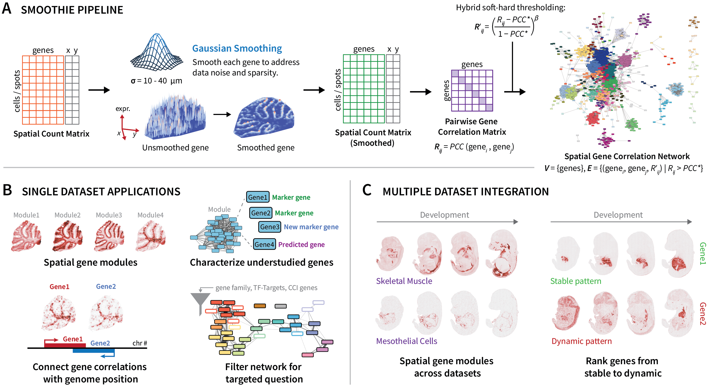
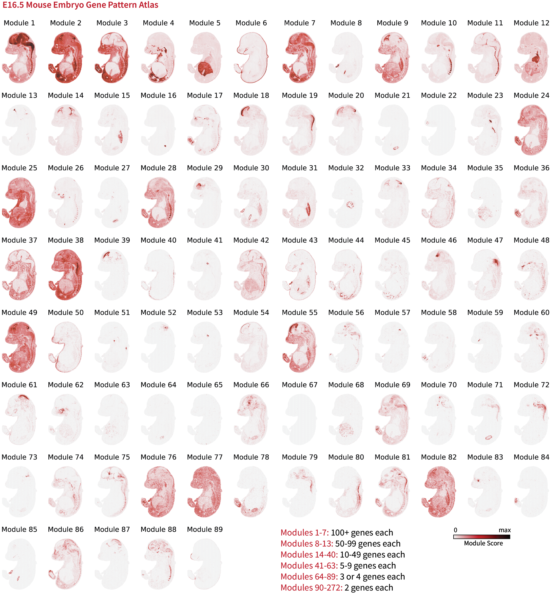

# Smoothie

**Documentation: [https://caholdener01.github.io/Smoothie/](https://caholdener01.github.io/Smoothie/)**

## Overview

Smoothie is a method that denoises spatial transcriptomics data with Gaussian smoothing and constructs and integrates genome-wide co-expression networks. Designed as a tool for biological discovery, Smoothie's output gene network allows for precise gene module detection, spatial annotation of uncharacterized genes, linkage of gene expression to genome architecture, and more. Further, using second-order correlation analysis, Smoothie supports multi-sample comparisons to assess stable or dynamic gene expression patterns across tissues, conditions, and time points.

Smoothie can generate a gene pattern atlas for your provided spatial dataset. We show the gene pattern atlas for the embryonic day 16.5 mouse embryo (Stereo-seq) below. Data retrieved from: [https://db.cngb.org/stomics/mosta/](https://db.cngb.org/stomics/mosta/).

## Features

- **Gaussian Smoothing**: In-place and grid-based smoothing options for flexibility and scalability across spatial omics platforms
- **Network Analysis**: Pairwise gene correlation measurement, hybrid hard-soft gene network thresholding, and Infomap network clustering for spatial gene module identification
- **Multi-Sample Integration**: Second-order correlation analysis for comparing gene patterns across datasets of mismatched (x,y) spatial coordinates
- **Visualization**: Comprehensive plotting functions for spatial modules and spatial gene expression patterns
- **Hyperparameter Selection**: Instructions and functions for selecting optimal smoothing and clustering parameters across different spatial technologies

## Installation

See [Installation](https://caholdener01.github.io/Smoothie/installation/). 

## Usage

To use Smoothie, make a clean copy of either the single-dataset or multi-dataset pipeline within [Examples](https://caholdener01.github.io/Smoothie/examples/single_dataset_pipeline/), and then follow the pipeline instructions. Refer to [Graphical Overview](https://caholdener01.github.io/Smoothie/graphical_overview/) for guidance too.

## Example Notebooks

[Examples](https://caholdener01.github.io/Smoothie/examples/single_dataset_pipeline/) contains two template Jupyter notebooks:

- **Single Dataset Pipeline**: for analyzing a single spatial transcriptomics dataset
- **Multi Dataset Pipeline**: for analyzing 2 or more comparable spatial transcriptomics datasets

## Completed Tutorials

[Tutorials](https://caholdener01.github.io/Smoothie/tutorials/slideseq_cerebellum_single_dataset_pipeline/) contains completed notebooks for the following datasets:

- **Single Dataset Pipelines**:
    - Slide-seq Adult Mouse Cerebellum
    - Stereo-seq Mouse E16.5 Embryo
    - Visium-HD Human Ovarian Cancer
    - Xenium Human Renal Cell Carcinoma
- **Multi-dataset Pipelines**:
    - Slide-seq Mouse Ovulating Ovaries Timecourse
    - Stereo-seq Mouse Embryonic Development Timecourse

## Additional Guides 

[Guides](https://caholdener01.github.io/Smoothie/guides/convert_to_anndata/) provides helpful extra information and resources to use Smoothie effectively.

1. **Convert to AnnData**: A guide to construct the AnnData structure for input to Smoothie
2. **Micron to Units Conversion Table**: A table of micron-to-units conversion factors for popular S.T. platforms (This info is required during the Gaussian smoothing step.)
3. **Cytoscape Instructions**: A guide to use Cytoscape to visualize Smoothie's output gene network with module labels

## Citation

If you use Smoothie, please cite:

Holdener, C. & De Vlaminck, I. (2025).
Smoothie: Efficient Inference of Spatial Co-expression Networks from Denoised Spatial Transcriptomics Data.
bioRxiv.
[https://doi.org/10.1101/2025.02.26.640406](https://doi.org/10.1101/2025.02.26.640406)

## License

This project is licensed under the MIT License - see the LICENSE file for details.

## Support

For questions, issues, or feature requests, please open an issue on [GitHub](https://github.com/caholdener01/Smoothie/issues).
