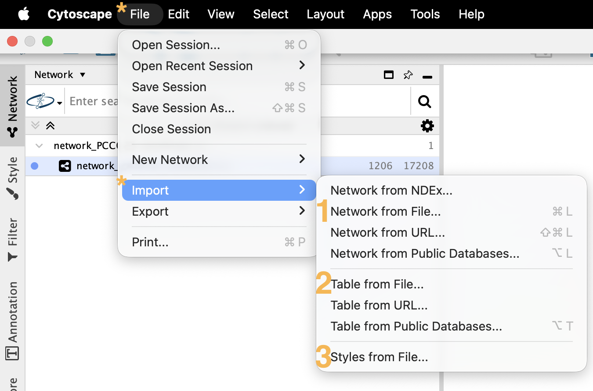
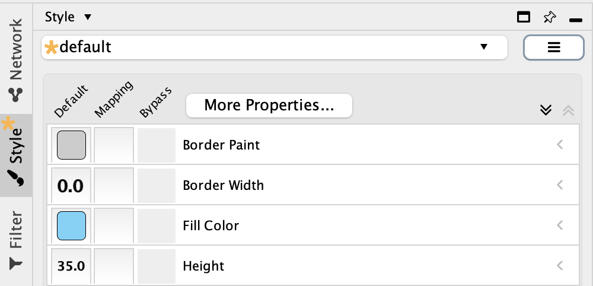
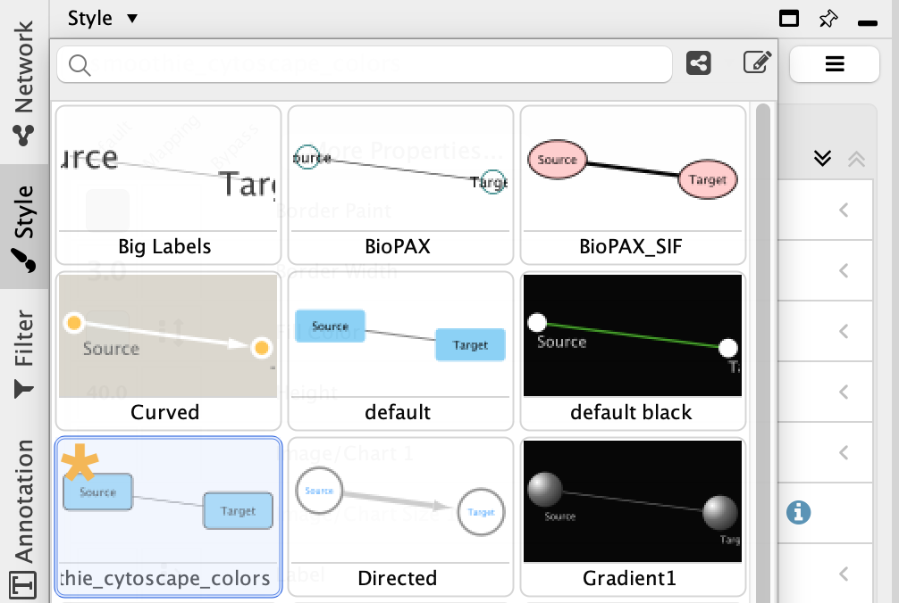
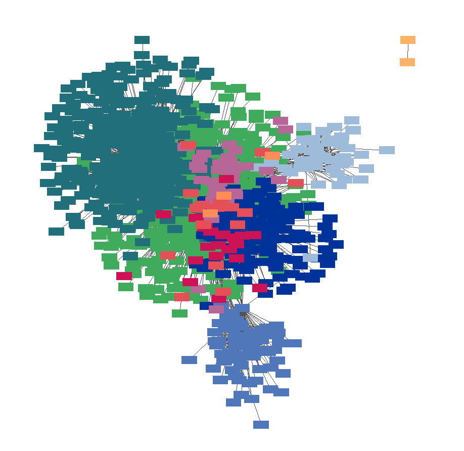

### **Step 1: Download Cytoscape to your Laptop**
* Cytoscape: [https://cytoscape.org/](https://cytoscape.org/)
* Cytoscape Download website: [https://cytoscape.org/download.html](https://cytoscape.org/download.html)

### **Step 2: Download Smoothie Outputs to your Laptop**
1. The function **smoothie.make_spatal_network** saves output files `network_[...].csv` and `nodelabels_[...].csv`. Download these two files from your server to your local laptop with Cytoscape installed.
2. Additionally, download `smoothie_cytoscape_colors.xml` from the Smoothie Github [https://github.com/caholdener01/Smoothie/raw/main/cytoscape_colors.xml](https://github.com/caholdener01/Smoothie/raw/main/cytoscape_colors.xml).

### **Step 3: Import Files into Cytoscape**
1. *File* > *Import* > *Network From File...*: Select `network_[...].csv` from your laptop.
2. *File* > *Import* > *Table From File...*: Select `nodelabels_[...].csv` from your laptop.
3. *File* > *Import* > *Styles From File...* Select `smoothie_cytoscape_colors.xml` from your laptop.

    

### **Step 4: Configure Network Styles**
1. Change your current default style to the new *smoothie_cytoscape_colors* style we just imported.

    
    
   
2. The network nodes should be colored by module label now. You may adjust other network stylistic features within the styles tab too.

    

### **Step 5: Explore Network Further**
Cytoscape has many useful features. You can explore more built-in features here: [https://cytoscape.org/](https://cytoscape.org/).