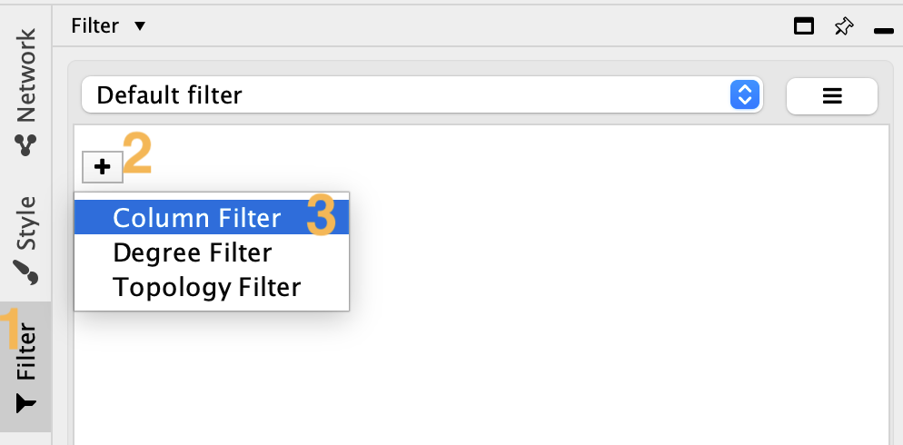
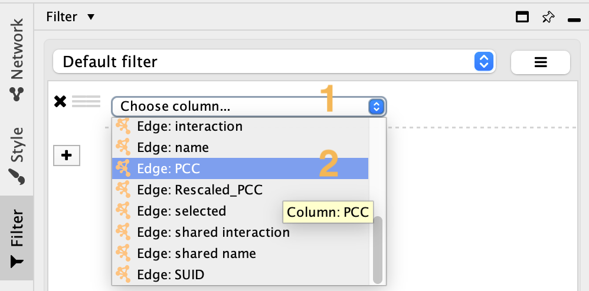
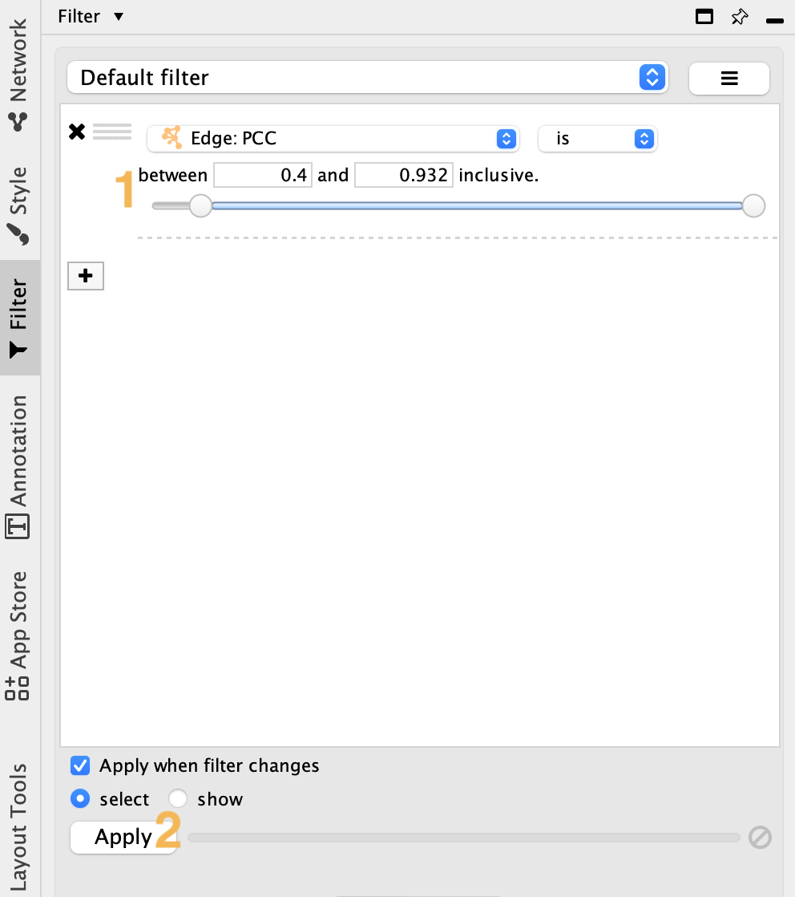
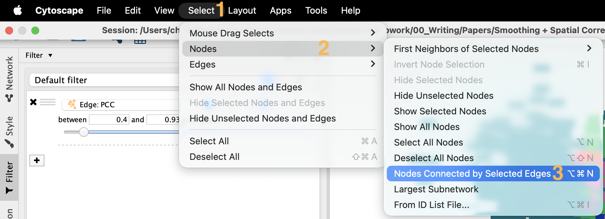
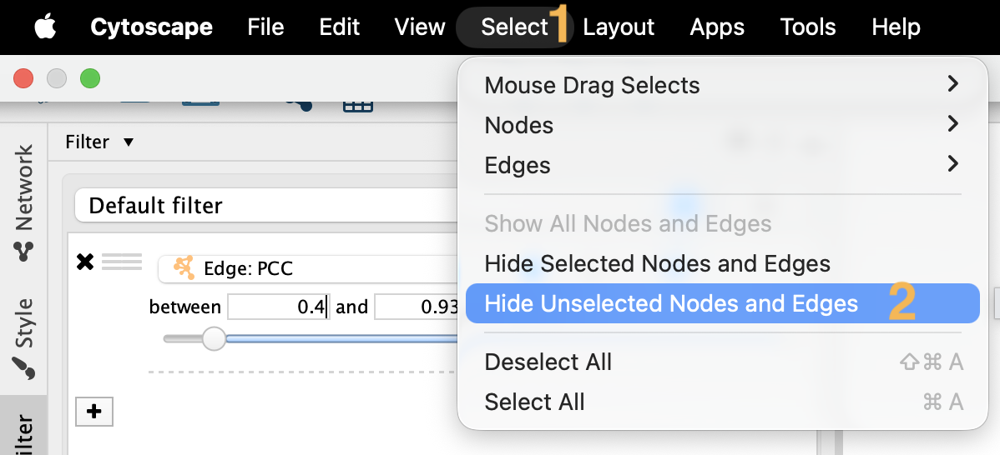
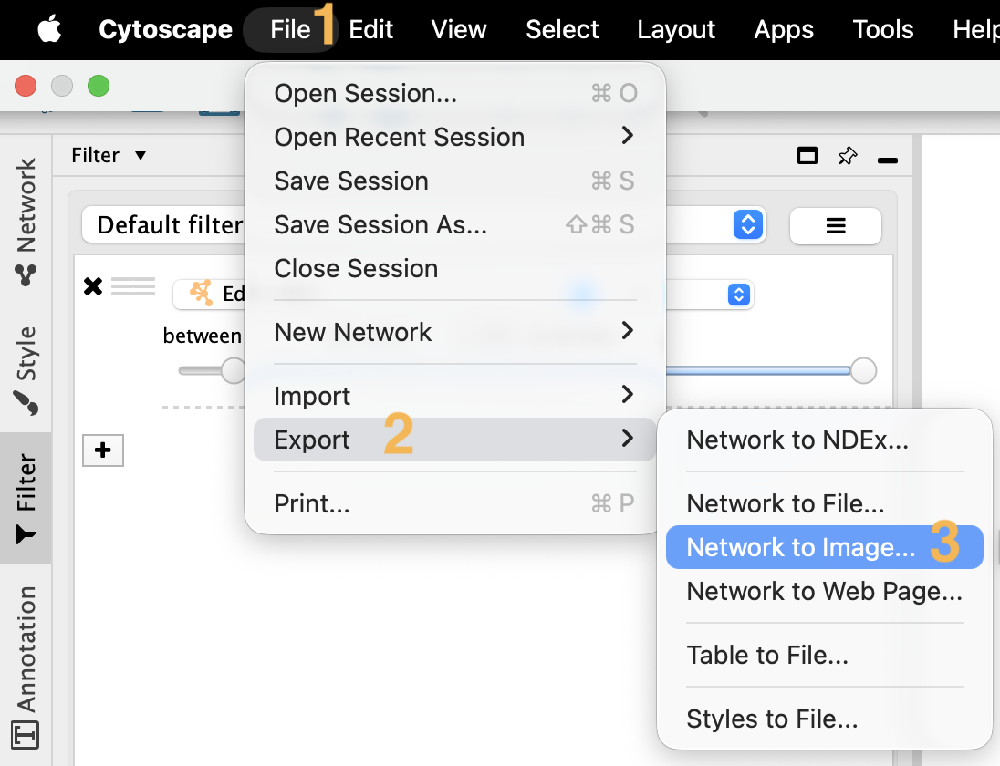
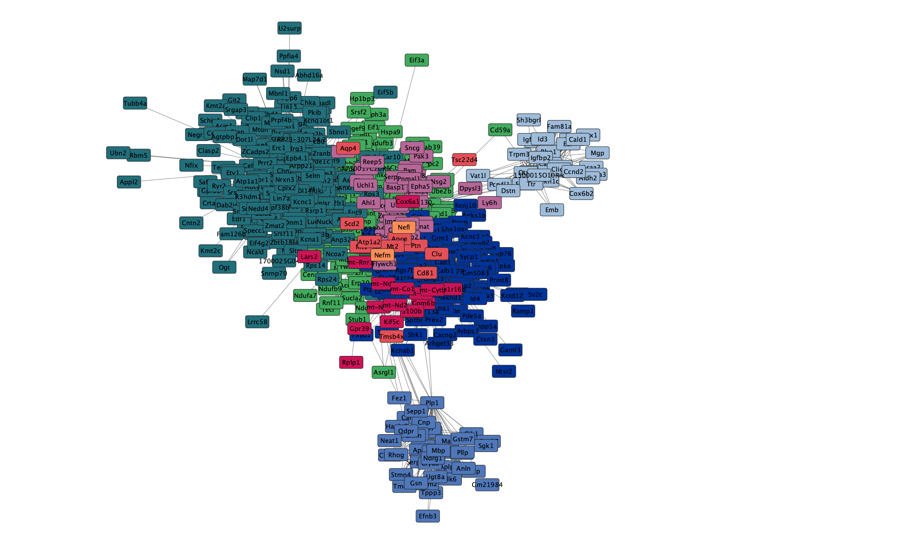

### **Step 1: Download Cytoscape to your Laptop**
* Cytoscape: [https://cytoscape.org/](https://cytoscape.org/)
* Cytoscape Download website: [https://cytoscape.org/download.html](https://cytoscape.org/download.html)

### **Step 2: Download Smoothie Outputs to your Laptop**
1. The function **smoothie.make_spatal_network** saves output files `network_[...].csv` and `nodelabels_[...].csv`. Download these two files from your server to your local laptop with Cytoscape installed.
2. Additionally, download `smoothie_cytoscape_colors.xml` from the Smoothie Github [https://github.com/caholdener01/Smoothie/blob/main/smoothie_cytoscape_colors.xml](https://github.com/caholdener01/Smoothie/blob/main/smoothie_cytoscape_colors.xml).

### **Step 3: Import Files into Cytoscape**
1. *File* > *Import* > *Network From File...*: Select `network_[...].csv` from your laptop.
2. *File* > *Import* > *Table From File...*: Select `nodelabels_[...].csv` from your laptop.
3. *File* > *Import* > *Styles From File...* Select `smoothie_cytoscape_colors.xml` from your laptop.

    

### **Step 4: Configure Network Styles**
1. Change your current default style to the new *smoothie_cytoscape_colors* style we just imported.

    
    
   
2. The network nodes should be colored by module label now. You may adjust other network stylistic features within the styles tab too.

    

### **(Optional) Step 5: Tidy up the Network's Appearance**
1. Add an edge filter for the network (Use the PCC column).

    
    

2. Slightly increase the PCC lower filter value (by 0.05 to 0.1) and apply the filter.

    

3. Next, select nodes connected by selected edges, and hide non-selected nodes and edges.

    
    

4. Export the network.

    
    

### **(Optional) Step 6: Explore Network Further**
Cytoscape has many useful features. You can explore more built-in features here: [https://cytoscape.org/](https://cytoscape.org/).